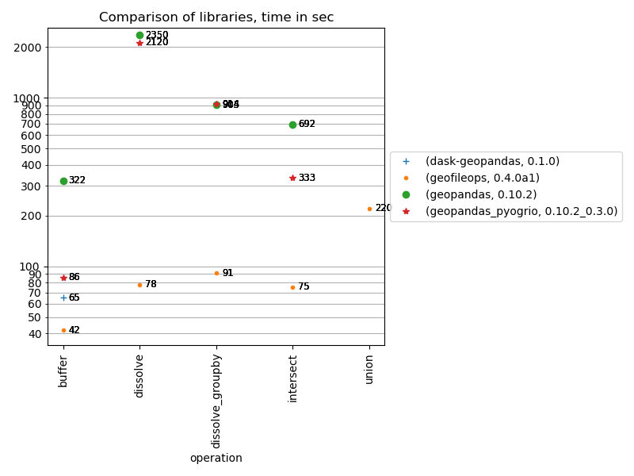

# geobenchmark
Benchmark to compare the performance of some python libraries for a specific 
case: process large geo files. 

The benchmarks included always follow the following usage scenario: 
1) read data from a geopackage file
2) do some processing
3) write the result to an output file

So, if you are looking for a library for another use case (eg. process many 
small files, do pure in-memory processing,...), use these benchmark results 
with a lot of caution!

The test files used are not that large (eg. 500.000 polygons, 350 MB .gpkg), 
but try to strike a balance between being large enough to give an idea on 
processing time to expect versus the time spent waiting for a benchmark to be 
run. They also fit in the memory of most desktops, so this makes it possible 
to also benchmark libraries that don't support files too large to fit in 
memory.

The following chart shows the main results of the benchmark:

