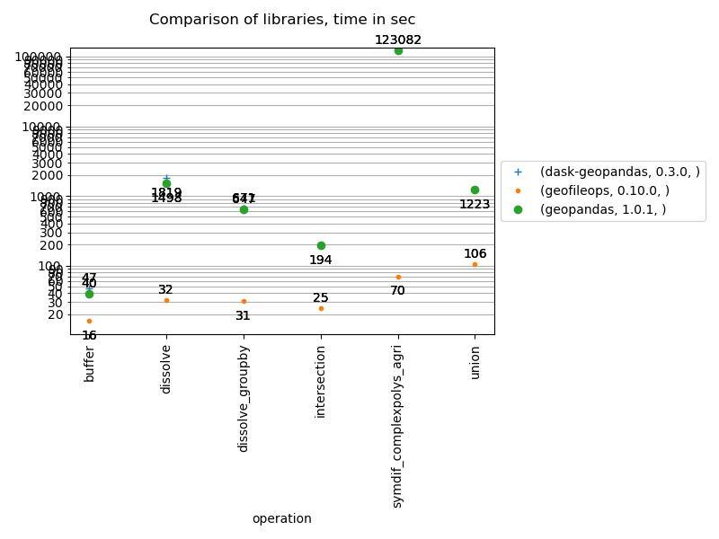
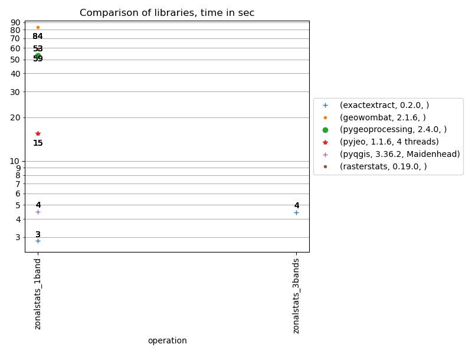

# geobenchmark
Some benchmarks to compare the performance of some python libraries for a few
specific use cases:

1. Vector ops: process large vector geo files, eg. calculate intersections,...
2. IO: performance to read/write vector geo files
3. Zonalstats: compare performance to calculate zonal stats

## Vector ops

The benchmarks included always follow the following usage scenario: 
1) read data from a geopackage file
2) do one spatial operation on the data
3) write the result to a geopackage file

So, if you are looking for a library for another use case (eg. process many 
small files, do pure in-memory processing,...), use these benchmark results 
with a lot of caution! 
Especially the buffer benchmark is at the time of writing for 90% I/O bound 
in geopandas!

The test files used are not that large (eg. 500k polygons, 350 MB .gpkg), 
but try to strike a balance between being large enough to give an idea on 
processing time to expect versus the time spent waiting for a benchmark to be 
run. They also fit in the memory of most desktops, so this makes it possible 
to also benchmark libraries that don't support files too large to fit in 
memory. When using geofileops on really large .gpkg files (> 10 GB), obviously 
the speed improvements become (even) more important. 

The benchmarks ran on a Windows workstation and the libraries were constrained
to use a maximum of 12 logical cores.

The following chart shows the main results of this benchmark.

## IO

Mainly a test of pyogrio performance

## Zonalstats

Comparison of different libraries/SW to calculate zonal statistics for polygons.

